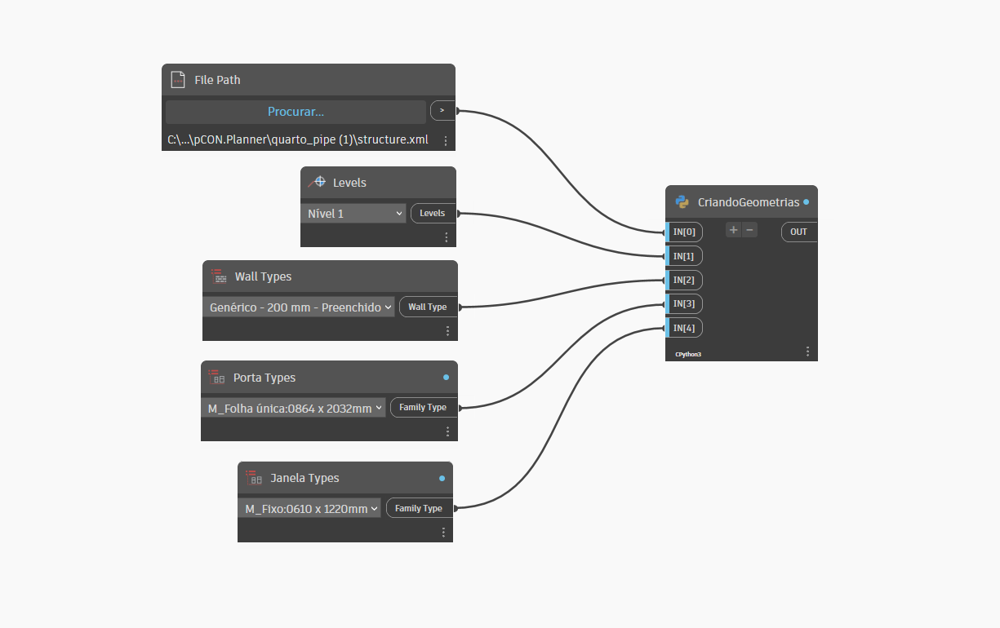

# ScanXMLtoRevit
 Um projeto Dynamo/Revit para converter representações de scan 3D para geometria nativa Revit utilizando Python.

## Descrição do Projeto
Este projeto tem como objetivo converter representações de scan 3D de ambientes em geometria nativa do Revit utilizando Dynamo e Python. A ferramenta permite a importação de arquivos XML contendo descrições de paredes e a construção automática dessas paredes no Revit.

## Funcionalidades
Leitura de Arquivo XML: Leitura de um arquivo XML que contém descrições detalhadas de paredes, portas e janelas, incluindo posição, comprimento, rotação e cor.
Conversão de Geometria: Conversão das descrições de paredes em linhas representando salas no Revit.
Entrada de Tipo de Parede e Nível do Projeto: Configuração do tipo de parede, portas e janelas através de Family Types, e seleção de nível do projeto no Revit.
Geração de Paredes: Construção das paredes no projeto Revit a partir dos dados fornecidos no xml.
Geração de aberturas: Posicionamento de portas e janelas a partir dos dados fornecidos no xml.

## Estrutura do Projeto
O projeto é composto pelos seguintes componentes principais:

Blocos Dynamo: File Path, Levels, Wall Types e Family Types. 
Script Python: lê o arquivo XML indicado, implementa a lógica de interpretação de dados e criação de paredes no Revit utilizando a API Revit.

## Roadmap
- [x] Leitura de arquivo XML do scan 3D (pcon.scan).
- [x] Seleção de nível do projeto Revit para criação de geometrias.
- [X] Seleção de tipo de paredes.
- [X] Seleção de tipo de portas.
- [X] Seleção de tipo de janelas.
- [X] Conversão de metros para pés.
- [X] Cálculo da posição dos pontos a partir de pontos + rotação em quaternion.
- [X] Criação de cômodos com API Revit.
- [X] Criação de aberturas nos cômodos com API Revit.
- [ ] Utilização de família de aberturas com propriedades dinâmicas (baseadas em comprimento e altura).
- [ ] Refino do posicionamento de janelas nos cômodos.

## Requisitos
Revit 2022 ou superior  
Dynamo 2.5 ou superior  
Python 3.x  
Bibliotecas: xml.etree.ElementTree, math, System, re, clr, Autodesk.DesignScript, RevitServices, Autodesk.Revit.DB. 

## Seja um dos contribuidores
Quer contribuir com esse projeto? Clique [AQUI](CONTRIBUTING.md) e leia como contribuir.

## Contato
Pedro Roque: [https://github.com/PedroThiagoRoque/ScanXMLtoRevit](https://github.com/PedroThiagoRoque/ScanXMLtoRevit)

## 📝 Licença
Os scripts python desse projeto estão sob licença. Veja o arquivo [LICENÇA](LICENSE.md) para mais detalhes.
